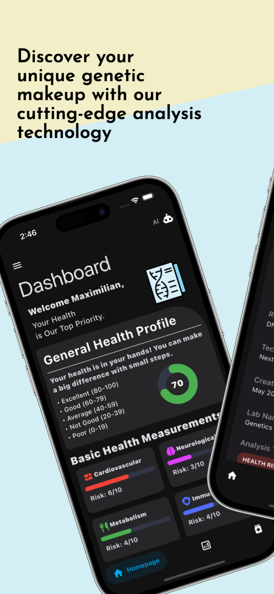
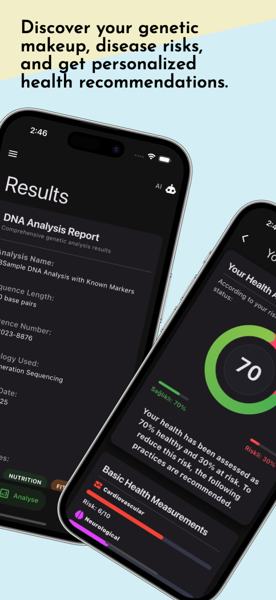
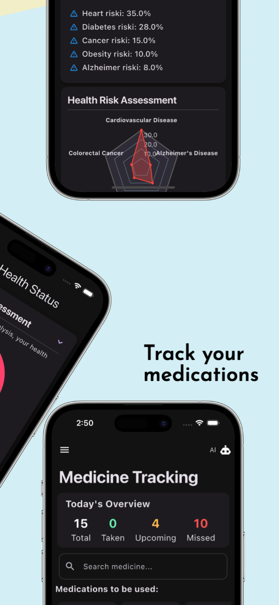
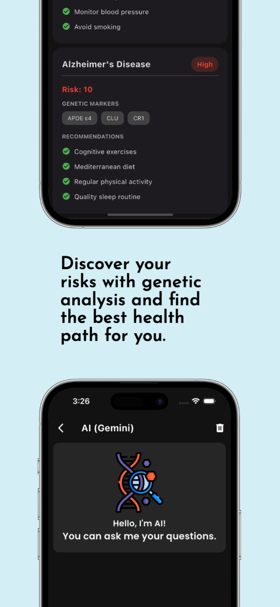
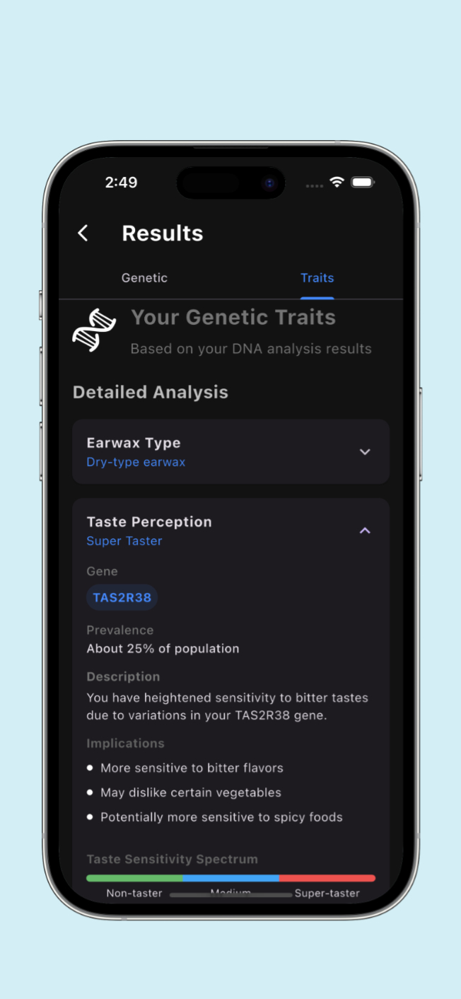
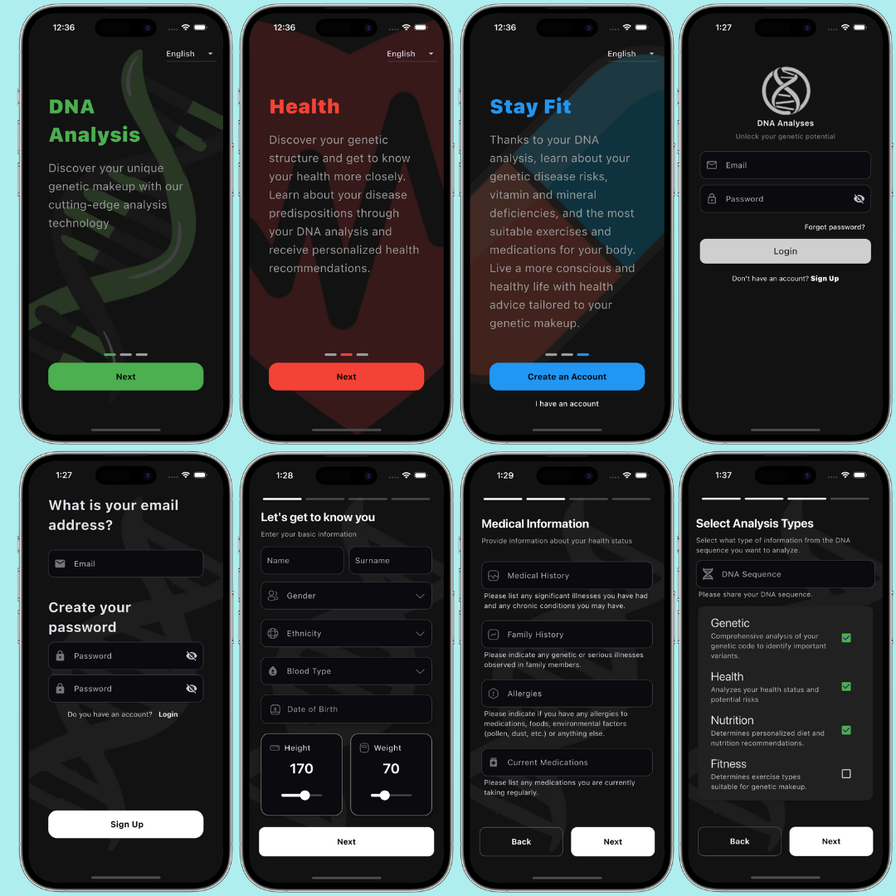

# 🧬 DNA Analyse app

# Introduction

This project is a cross-platform health and wellness application built using Flutter and Supabase (as the backend database). While Supabase and Gemini APIs are not actively integrated, the app simulates real data using a pre-defined JSON file and displays it using FutureBuilder.

The application supports iOS, Android, macOS, and Chrome platforms. It includes several modern features such as dynamic app icon switching for Apple devices, light and dark mode support, and localization (l10n) with English and Turkish language options.

The app is designed to provide users with a personalized genetic health overview based on input data, including features such as health risk analysis, nutrition recommendations, fitness guidance, and AI-based assistance.

# Features

## 🧬 DNA & Health Profile
During registration, users are prompted to enter:
- DNA sequence
- Name, surname, age, height, weight
- Gender, blood type, current medications, and medical history

Based on this information, the app provides:
- DNA overview
- Genetic traits such as taste perception, circadian rhythm, color vision, muscle strength, pain sensitivity, and immune system characteristics

## ⚕ Health Risk Analysis

- Displays health risks and genetic factors through a detailed profile

Includes a Radar Chart (Spider Web Graph) to visualize:
- Body Mass Index (BMI)
- Sleep quality
- Blood pressure
- Blood sugar
- Cholesterol levels

## 🥗 Nutrition Profile
- Offers insights based on the user’s metabolism type and rate
- Personalized diet plans and nutritional advice
- Analyzes vitamin and mineral levels to identify deficiencies or excesses
- Suggests protection tips for maintaining optimal health
- Provides tailored advice for weight loss or gain

## 🏋️‍♂️ Fitness Profile
Evaluates physical performance including:
- Muscle strength
- Endurance
- Flexibility
- Recommends training plans based on user goals
- Muscle fiber composition analysis (fast-twitch vs. slow-twitch) helps optimize workout plans

## 🤖 AI Chat (Gemini Integration)
- Includes a built-in AI chat interface powered by Gemini
- Users can ask health-related questions and receive contextual responses
- Tapping on recommended medications or precautions opens AI explanations

## 💊 Medication Tracker
- Displays all suggested medications
- For each medication, users can see:
- Dosage time
- Notes
- Intake schedule
- Users can also manually add new medications if needed

## Preview

 
 
 
  

  

# Screenshots
 

## Analysing

## Getting Started

This project is a starting point for a Flutter application.

A few resources to get you started if this is your first Flutter project:

- [Lab: Write your first Flutter app](https://docs.flutter.dev/get-started/codelab)
- [Cookbook: Useful Flutter samples](https://docs.flutter.dev/cookbook)

For help getting started with Flutter development, view the
[online documentation](https://docs.flutter.dev/), which offers tutorials,
samples, guidance on mobile development, and a full API reference.
